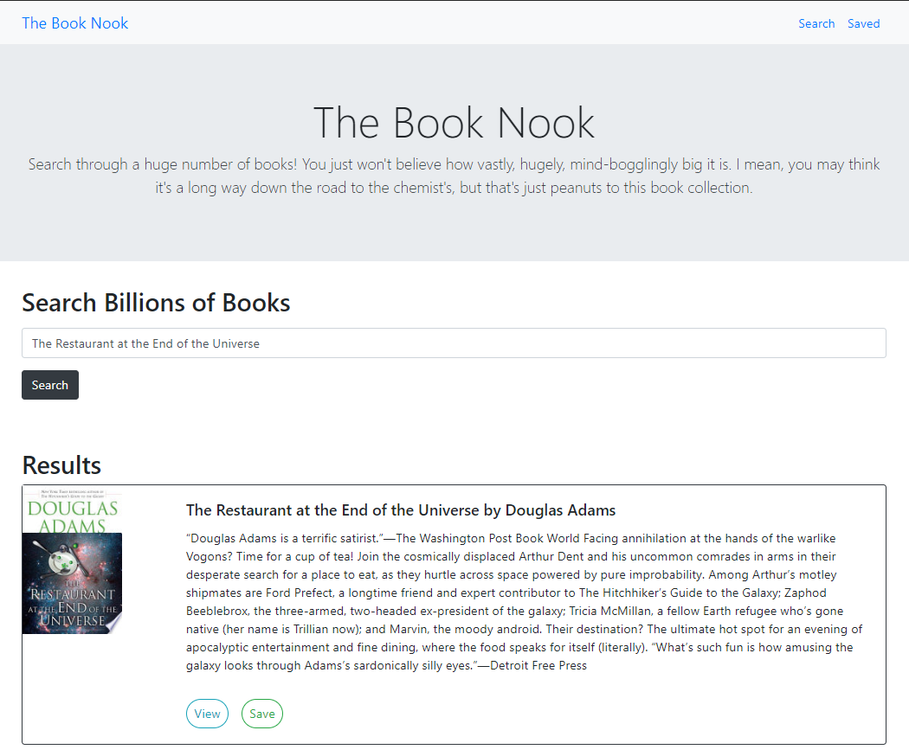

# My Portfolio
[Deployed Site](https://morning-everglades-46777.herokuapp.com/)

  

## Description
A book searching application that utilizes Google Books and is built with the React framework and MongoDB.

## License

This project is licensed under the MIT License.
